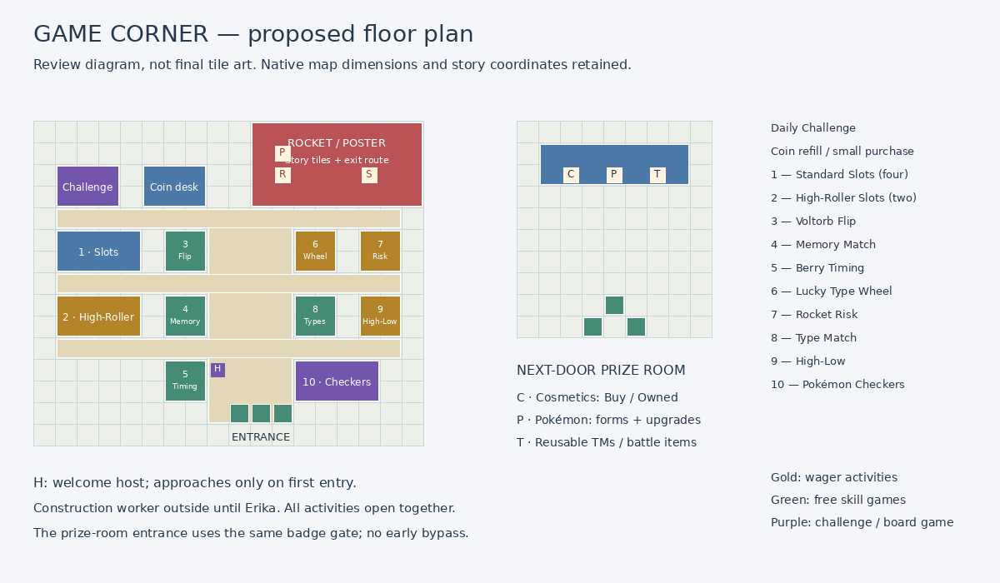
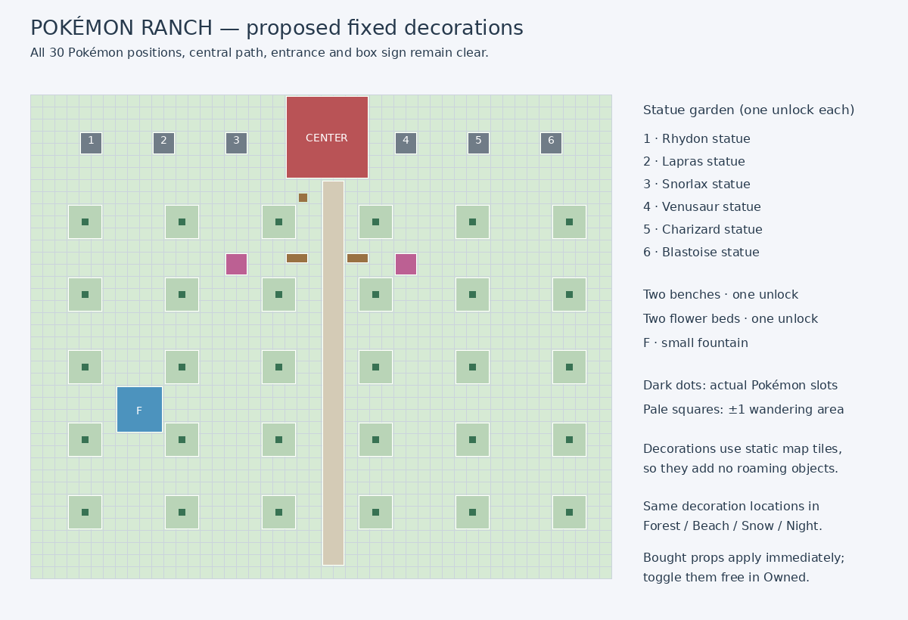

# Game Corner and Ranch layout proposal — October 5, 2026

**Arrangement approved October 5. Phase 6 implements fixed Ranch props and themes; the four current arcade cabinets are implemented.** The diagrams retain the full future arcade proposal. Other proposed cabinets remain pending.

## Arcade arrangement

Keep the native 18×15 room and its outdoor entrance/exit links. Four standard slots occupy the upper-left bank; two visually distinct high-roller machines below. The center-left strip has Voltorb Flip, Memory Match and Berry Timing. The right side has Lucky Type Wheel, Rocket Risk, Type Match and High-Low, with a wider Checkers table at the lower right. A Daily Challenge terminal and coin refill/small-purchase service occupy the upper-left counter area. Service machines and game terminals use background interactions, not extra roaming objects.

The center aisle and three horizontal cross-aisles stay open. The welcome host starts at (8,11), walks through the reserved lower-center aisle to the tile beside the player and returns after the one-time gift. Its destination adapts to the native entrance landing position; no teleport or hard-coded assumption that only one of the three existing exit/entry warps is used. Stage the speech and gift before continuing normal field control, with permanent completion state and safe existing-save/item ownership handling.

Reserve x=10–17, y=0–3 for native Rocket progression. Keep the poster at (11,1), grunt at (11,2), stairs warp at (15,2), hidden/revealed stair metatiles, guard removal and rightward exit movement. This red review zone contains both story scenery and accessible floor; it is not a solid red wall in the game. Retain all native story flags and trainer IDs. Hidden coin events must remain on accessible floor or be deliberately relocated with their original flags preserved.

## Prize room and badge gate

Keep the existing 9×10 next-door prize room. Reuse its three clerk positions: Cosmetics at (2,2), Pokémon at (4,2), TMs / Battle Items at (6,2). Cosmetics offers Buy/Owned and previews; Pokémon handles supported Rotom forms, Normal/HA/Shiny/both, run ability settings and MGM; the right clerk separates reusable TMs from repeatable battle items. Preserve outdoor warp links and ordinary exit behavior.

Both buildings must be inaccessible before Erika. The main arcade gets the construction worker outside its existing entrance at city (34,21), standing immediately south at (34,22). The separate prize-room door at city (39,20) is closed/signposted by the same badge gate, so it cannot bypass the main entrance block. A second worker is unnecessary. After the Rainbow Badge both doors open and the main arcade welcome is eligible. Older saves already inside must still be allowed to leave; do not trap them behind an exterior NPC. Verify active-object culling in the city before adding the worker.

Suggested construction dialogue:

> Sorry! The GAME CORNER is under construction.
> Exciting new games and prizes are coming soon!

Draft welcome dialogue can remain short and refer humorously to the shady fellow in the back; the hideout is not explained.

## Fixed Ranch decorations

Preserve the existing 48×40 pasture, Center façade, (24,6) door, (22,8) box sign, center path and all 30 PC-slot Pokémon positions. Six independently purchased statues line the north garden, three on either side of the Center. Each unlock installs that species in its own predetermined location; it does not replace a different statue or allow manual placement.

| Unlock | Proposed top-left tile / footprint | Starting price |
|---|---|---:|
| Rhydon statue | (4,3), 2×2 | 750 |
| Lapras statue | (10,3), 2×2 | 750 |
| Snorlax statue | (16,3), 2×2 | 750 |
| Venusaur statue | (30,3), 2×2 | 750 |
| Charizard statue | (36,3), 2×2 | 750 |
| Blastoise statue | (42,3), 2×2 | 750 |
| Bench pair | (21,13) and (26,13), each 2×1 | 300 for both |
| Flower beds | (16,13) and (30,13), each 2×2 | 300 for both |
| Small fountain | (7,24), 4×4 | 1,200 |

Bench/flower purchases install the whole illustrated set, not a second charge per prop. The fountain sits in a gap between pasture lanes. The six statue species and these placements are part of this review proposal; they are not claimed as already approved finished assets. Adapt existing large doll art into stone/pedestal tile art and preview the result. Static map tiles avoid consuming Pokémon object/sprite slots. Animation for a fountain is optional and must not consume an extra object or change game mechanics.

Every decoration footprint is clear of all Pokémon's current ±1 roaming area. Theme selection changes terrain art/palettes only: Forest, Beach, Snow and Night keep the same coordinates and collision/movement rules. No surfable shortcut, snow sliding, healing, friendship, EXP or item farming is attached. Bought cosmetics immediately apply, remain owned permanently, and can be freely toggled/reselected; Default remains free.

## Validation and remaining review

`plan.json` is the coordinate source. Run `.github/scripts/render_chaos_arcade_layout.py` to regenerate both SVG and PNG diagrams. Its design validator checks that arcade zones do not overlap one another or protected story scenery, activities have a reachable adjacent interaction tile, the Rocket/stair approach is reachable in the proposed floor graph, and decorations avoid every native pasture roaming footprint, building, sign and central path.

This is a conceptual footprint check, not an emulator test of finished collision tiles or NPC movement. Final native tile art/palettes, interactive facing tiles, city badge gate, host walk, Rocket exit, hidden coins, sprite culling and all themes require implementation and emulator verification. The user approved this arrangement. Implement and verify native art/collision before a final release.
